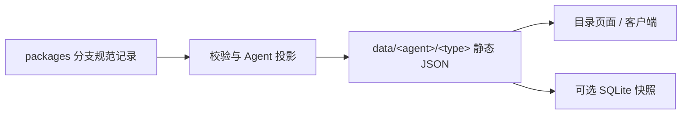

# Agent Forge

**面向 Agent 工具的开放元数据目录。** 汇集 MCP Server、Plugin、Skill、General 工具与 Bundle，以静态 JSON 提供发现、版本查询和按 Agent 划分的数据源。

[中文](README.md) | [English](README_en.md)

[](https://github.com/metaone01/agent-forge/actions/workflows/validate.yml)
[](https://github.com/metaone01/agent-forge/actions/workflows/project.yml)
[](https://github.com/metaone01/agent-forge/actions/workflows/release.yml)

[目录站点](https://metaone01.github.io/agent-forge/) · [Dashboard](https://metaone01.github.io/agent-forge/dashboard/) · [Schema 文档](docs/schema/README.md) · [提交记录](https://github.com/metaone01/agent-forge/issues/new/choose)

> [!WARNING]
> Agent Forge 整合第三方元数据，不审查上游代码、不认证发布者、不执行安装，也不保证来源、兼容性或安全性。链接可用、checksum、signature、facet 和 advisory 都不能替代安全审查。

## 可以用它做什么

- **查找工具**：静态页面按 Agent、类型等条件筛选目录，按需加载包详情；Dashboard 展示元数据统计。
- **接入目录**：客户端读取独立的 Agent/type 数据源，获取版本、兼容声明、依赖关系与发行候选。
- **维护记录**：通过 Git 和 Pull Request 管理 JSON，使用 JSON Schema 与跨文件校验约束数据。
- **构建离线索引**：从生成数据构建按 Agent/type 拆分的 SQLite FTS5 快照。

在线读取以静态 JSON 为公共契约，无需数据库或动态 API。当前浏览页面不依赖运行时 CDN 或后端服务，不保存 GitHub token，也不提供写入接口。

> [!NOTE]
> README 介绍项目定位、数据契约与使用入口，不维护实时包数量、Agent 清单或最新 revision。元数据由独立的 `packages` 分支维护，README 不同步到该分支；最新已发布内容以站点及其 manifest 为准。

## 查看最新数据

| 需要的信息 | 查看入口 |
| --- | --- |
| 已发布工具、版本与 Agent 筛选 | [目录站点](https://metaone01.github.io/agent-forge/) |
| 已发布收录数量、分类统计与更新时间 | [Dashboard](https://metaone01.github.io/agent-forge/dashboard/) |
| 已发布 revision、生成时间和数据源列表 | [数据 manifest](https://metaone01.github.io/agent-forge/data/manifest.json) |
| 最新入库的规范记录 | [`packages` 分支](https://github.com/metaone01/agent-forge/tree/packages/sources) |
| 发布历史与离线产物 | [Releases](https://github.com/metaone01/agent-forge/releases) |
| 发布进度与失败原因 | [发布工作流运行记录](https://github.com/metaone01/agent-forge/actions/workflows/release.yml) |

`packages` 中的新记录需要经过发布流程才会出现在站点中。比较数据时请查看 `revision` 与 `generatedAt`；分支最新内容、站点最近发布的数据和某个历史 Release 可能对应不同 revision。校验通过不代表部署成功或上游链接可用。

Pages 发布流程读取 `packages` 元数据，生成目录数据及离线快照，并部署页面与数据。[工作流配置](https://github.com/metaone01/agent-forge/blob/main/.github/workflows/release.yml)是触发条件、发布频率与跳过规则的查询入口。

## 收录范围

| 类型 | 收录内容 | 说明 |
| --- | --- | --- |
| `mcp` | MCP Server 及其发行信息 | 包含声明的注册表包或远程端点 |
| `plugin` | Agent 插件 | 皮肤可通过 `subtype=skin` 表达 |
| `skill` | Skill 文档或包 | 记录明确的 Skill 入口，如 `SKILL.md` |
| `general` | 独立可用的其他 Agent 工具 | 用 `generalDetails.toolType` 和 `agentUse` 描述用途 |
| `bundle` | 包或嵌套 Bundle 的元数据集合 | 描述成员关系，不分发工具本体 |

`general` 是明确的工具类别，不是未知类型的兜底。普通系统包或语言包不在收录范围内；npm、PyPI、Cargo、OCI 等是发行渠道，不是新的工具类别。`targets` 是 Agent 关联与兼容声明，未知版本范围不构成宿主支持的证据。

## 读取数据源

`packages` 分支的规范记录保存在 `sources/<type>/`；生成器根据记录的 `targets` 将它们投影为 `data/<agent>/<type>/`。每个生成源有自己的 `sourceId`、manifest 和 index，客户端显式选择需要的源。



公开数据的发现入口为 [`data/manifest.json`](https://metaone01.github.io/agent-forge/data/manifest.json)。从中读取实际发布的 Agent/type 源，无需在客户端硬编码清单，也不要假设每个 Agent 都有全部五类数据。一个源的结构如下：

```text
data/<agent>/<type>/
  source.json          # 源标识、revision、index 和元数据镜像
  index.json           # 名称、版本列表、latest 与详情相对路径
  packages/**/*.json   # 包版本详情
```

接入时请遵守以下规则：

1. 从 `data/manifest.json` 的 `sources[].path` 发现索引，路径相对 `data/`；包详情的 `path` 相对所在源目录。
2. 使用全局 `id` 引用依赖与 Bundle 成员。同一包的版本共享 `id`；跨类别可同名，类别内名称唯一。查询与缓存键包含 source、Agent、type 和 name。
3. 保持同一批生成文件的 `revision` 一致；元数据镜像必须声明相同 revision。`sourceMirrors` 是目录镜像，`distributions` 是工具本体的发行候选，不能混用。
4. 保留未知 `_meta` 值。它是唯一开放扩展点，键使用反向域名命名空间；超过 4096 UTF-8 字节时校验器会警告。

> [!IMPORTANT]
> 消费端展示 checksum、signature 或 advisory 时，必须同时展示以下声明。脚本安装记录需要 `scriptIntegrity`，但完整性材料不构成信任；执行前仍需获得用户确认。
>
> Third-party metadata. Availability checks and integrity material are not security reviews. No guarantee of accuracy, completeness, timeliness, or safety.

## 本地验证与预览

<details>
<summary>开发者：本地校验、静态预览与离线快照</summary>

这些命令使用当前 checkout 中的代码与记录，不会自动获取 `packages` 的最新元数据，也不代表公开站点的当前状态。

需要 **Python 3.10+** 和 **uv**。在仓库根目录执行；测试命令显式提供依赖，校验脚本通过内联依赖声明运行。

```sh
uv run --with jsonschema --with referencing python -m unittest discover -s tests -v
uv run tools/validate.py --all
```

单条记录也可以独立校验：

```sh
uv run tools/validate.py examples/package-mcp.json package.schema.json
```

本地预览需将页面和生成的 `data/` 放在同一个静态站点根目录。以下命令适用于 PowerShell 和常见 Unix shell，会更新忽略的 `pages-staging/` 预览目录：

```sh
uv run tools/project.py --output data --base-url http://localhost:8000/data
uv run python tools/build_site.py --output pages-staging --data data
uv run python -m http.server 8000 --bind 127.0.0.1 --directory pages-staging
```

打开 [本地目录](http://localhost:8000/) 或 [本地 Dashboard](http://localhost:8000/dashboard/)。端口被占用时，同时调整 `--base-url` 和 server 端口；直接打开 HTML 会受浏览器 `fetch` 限制，仅服务 `site/` 也不会生成所需数据。

生成器按时间戳和截止规则筛选记录，可能排除过新或无可用时间戳的记录。实际截止时间见生成 manifest 的 `cutoff`，参数与默认值见 `uv run tools/project.py --help`。

可选的离线快照使用 Python 内置 SQLite FTS5，读取 `data/` 并更新 `snapshots/` 下的数据库：

```sh
uv run tools/project.py
uv run tools/snapshot.py --data data --output snapshots
```

</details>

## 贡献元数据

1. 从 `packages` 创建贡献分支，参考其 Schema、示例与[字段文档](docs/schema/README.md)，选择一种类型；非 Bundle 记录需要发行候选。
2. 将包版本 JSON 放入 `sources/<type>/packages/`，更新对应 `index.json` 的版本、latest 和相对详情路径，并保持源与索引 revision 一致。
3. 保留上游原始版本字符串；`versionScheme` 仅作为比较提示。记录来源、兼容性未知项与发行链接，不暗示已经过安全核验。
4. 运行上述测试与完整校验，再向 `packages` 分支发起元数据 Pull Request。README 等文档改动在文档所在分支维护。也可以通过[可视化上传页](https://metaone01.github.io/agent-forge/submit/)填写元数据并自动生成 JSON，再到 GitHub 确认提交。Agent 可使用 [JSON Issue 表单](https://github.com/metaone01/agent-forge/issues/new?template=package-submission.yml)或[机器提交契约](https://metaone01.github.io/agent-forge/submit/contract.json)；Submission Notes 可选。

符合条件的 `package-submission` Issue 会由工作流生成面向 `packages` 的提案 Pull Request，仍需审阅和校验。自动合并的条件以[冷却工作流](https://github.com/metaone01/agent-forge/blob/main/.github/workflows/package-cooldown.yml)、仓库规则和必需检查为准。

README 与其他文档按项目说明或操作方式的变化更新，不随包数据更新。批量导入工具的 `--apply` 会写入规范记录和索引，使用前应审阅预览结果。

## 文档与仓库导航

| 入口 | 内容 |
| --- | --- |
| [`docs/schema/`](docs/schema/README.md) | 四份 Schema 的中英文字段参考与注释示例 |
| 根目录 `*.schema.json` | 机器可读契约，当前 `schemaVersion` 为 `2` |
| [`packages` 中的 `sources/`](https://github.com/metaone01/agent-forge/tree/packages/sources) | 按类型维护的最新规范记录与索引 |
| [`tools/`](tools/) / [`tests/`](tests/) | 采集、导入、校验、投影、快照工具与测试 |
| [`site/`](site/README.md) | 静态目录与 Dashboard 的数据契约 |
| [架构说明](docs/ARCHITECTURE.md) | 契约设计与扩展方向；发布流程读取 `packages` 分支 |
| [实施计划](docs/IMPLEMENTATION-PLAN.zh-CN.md) | 阶段规划 |
| [修改历史](docs/MODIFICATION-HISTORY.md) | 历史契约变更背景 |

Schema 的稳定 `$id` 位于 `https://metaone01.github.io/agent-forge/` 下的 `package.schema.json`、`source.schema.json`、`index.schema.json` 和 `advisory.schema.json`。兼容扩展保持 `$id` 稳定，破坏性契约变更才提升 `schemaVersion`。

`data/`、`snapshots/`、`pages-staging/` 和采集缓存是忽略的本地产物；规范记录以 `packages` 分支的 `sources/` 为准，公开数据以已发布 revision 为准。
