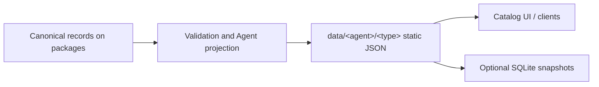

# Agent Forge

**An open metadata catalog for Agent tools.** Discover MCP servers, Plugins, Skills, General tools, and Bundles through static JSON, version indexes, and Agent-specific sources.

[中文](README.md) | [English](README_en.md)

[](https://github.com/metaone01/agent-forge/actions/workflows/validate.yml)
[](https://github.com/metaone01/agent-forge/actions/workflows/project.yml)
[](https://github.com/metaone01/agent-forge/actions/workflows/release.yml)

[Catalog site](https://metaone01.github.io/agent-forge/) · [Dashboard](https://metaone01.github.io/agent-forge/dashboard/) · [Schema documentation](docs/schema/README_en.md) · [Submit a record](https://github.com/metaone01/agent-forge/issues/new/choose)

> [!WARNING]
> Agent Forge integrates third-party metadata. It does not review upstream code, certify publishers, execute installations, or guarantee origin, compatibility, or safety. Reachable links, checksums, signatures, facets, and advisories do not replace a security review.

## What You Can Do

- **Find tools**: filter the static catalog by Agent, type, and other criteria, load package details on demand, and explore metadata statistics on the Dashboard.
- **Integrate a catalog**: consume independent Agent/type sources for versions, compatibility claims, dependencies, and distribution candidates.
- **Maintain records**: manage JSON through Git and Pull Requests, with JSON Schema and cross-file validation.
- **Build offline indexes**: generate SQLite FTS5 snapshots split by Agent/type from the projected data.

Static JSON is the public read contract; no database or dynamic API is required. The current frontend has no runtime CDN or backend dependency, stores no GitHub token, and exposes no write API.

> [!NOTE]
> This README covers the project's purpose, data contract, and entry points. It does not maintain live package counts, Agent lists, or the latest revision. Metadata is maintained on the separate `packages` branch; READMEs are not copied there. The site and its manifest identify the latest published content.

## Find Current Data

| Information | Entry point |
| --- | --- |
| Published tools, versions, and Agent filters | [Catalog site](https://metaone01.github.io/agent-forge/) |
| Published counts, category statistics, and update time | [Dashboard](https://metaone01.github.io/agent-forge/dashboard/) |
| Published revision, generation time, and source list | [Data manifest](https://metaone01.github.io/agent-forge/data/manifest.json) |
| Latest canonical records in Git | [`packages` branch](https://github.com/metaone01/agent-forge/tree/packages/sources) |
| Publication history and offline artifacts | [Releases](https://github.com/metaone01/agent-forge/releases) |
| Publication progress and failure details | [Publication workflow runs](https://github.com/metaone01/agent-forge/actions/workflows/release.yml) |

New records on `packages` appear on the site after publication. Compare `revision` and `generatedAt`: the branch head, the most recently published site data, and a historical Release may represent different revisions. Passing validation does not prove successful deployment or upstream link availability.

Pages publication reads metadata from `packages`, generates catalog data and offline snapshots, and deploys the frontend together with its data. Consult the [workflow configuration](https://github.com/metaone01/agent-forge/blob/main/.github/workflows/release.yml) for triggers, publication frequency, and skip rules.

## Catalog Scope

| Type | Content | Notes |
| --- | --- | --- |
| `mcp` | MCP servers and distribution metadata | Includes declared registry packages or remote endpoints |
| `plugin` | Agent plugins | Skins can use `subtype=skin` |
| `skill` | Skill documents or packages | Records explicit Skill entry points, such as `SKILL.md` |
| `general` | Other independently usable Agent tools | Described by `generalDetails.toolType` and `agentUse` |
| `bundle` | Metadata collections of packages or nested Bundles | Describes membership without distributing tools |

`general` is a specific tool category, not a fallback for unknown types. Ordinary system or language packages are out of scope. npm, PyPI, Cargo, OCI, and similar registries are distribution channels, not additional tool categories. `targets` records Agent associations and compatibility claims; an unknown version range is not evidence of host support.

## Consume Metadata Sources

Canonical records live in `sources/<type>/` on the `packages` branch. The generator projects each record into `data/<agent>/<type>/` according to its `targets`. Each generated source has its own `sourceId`, manifest, and index; consumers explicitly select the sources they need.



Discover public data through [`data/manifest.json`](https://metaone01.github.io/agent-forge/data/manifest.json). Read the actual published Agent/type sources from it instead of hardcoding a list in the client. Do not assume that every Agent has all five types. Each source has this layout:

```text
data/<agent>/<type>/
  source.json          # Source identity, revision, index, and metadata mirrors
  index.json           # Names, versions, latest, and relative detail paths
  packages/**/*.json   # Package-version details
```

Consumer rules:

1. Discover indexes through `sources[].path` in `data/manifest.json`; these paths are relative to `data/`. Package detail paths are relative to their source directory.
2. Reference dependencies and Bundle members by global `id`. Versions of one package share an id. Equal names across categories are allowed; names within a category are unique. Include source, Agent, type, and name in lookup and cache keys.
3. Keep the `revision` consistent across a generated set. Metadata mirrors must declare the same revision. `sourceMirrors` describes catalog mirrors; `distributions` describes candidates for obtaining the actual tool. Do not interchange them.
4. Preserve unknown `_meta` values. This is the only open extension point; keys use reverse-DNS namespaces. The validator warns above 4096 serialized UTF-8 bytes.

> [!IMPORTANT]
> Consumers must display the following statement when presenting checksums, signatures, or advisories. Script installation records require `scriptIntegrity`, but integrity material does not establish trust; execution still requires user confirmation.
>
> Third-party metadata. Availability checks and integrity material are not security reviews. No guarantee of accuracy, completeness, timeliness, or safety.

## Validate and Preview Locally

<details>
<summary>Developers: local validation, static preview, and offline snapshots</summary>

These commands use the code and records in the current checkout. They do not automatically fetch the latest metadata from `packages` or describe the public site's current state.

Requirements: **Python 3.10+** and **uv**. Run from the repository root. The test command supplies its dependencies explicitly; the validator uses inline script dependency declarations.

```sh
uv run --with jsonschema --with referencing python -m unittest discover -s tests -v
uv run tools/validate.py --all
```

Validate an individual record:

```sh
uv run tools/validate.py examples/package-mcp.json package.schema.json
```

For preview, place the frontend and generated `data/` under the same static site root. These commands work in PowerShell and common Unix shells and update the ignored `pages-staging/` preview directory:

```sh
uv run tools/project.py --output data --base-url http://localhost:8000/data
uv run python tools/build_site.py --output pages-staging --data data
uv run python -m http.server 8000 --bind 127.0.0.1 --directory pages-staging
```

Open the [local catalog](http://localhost:8000/) or [local Dashboard](http://localhost:8000/dashboard/). If the port is occupied, change both `--base-url` and the server port. Opening HTML directly encounters browser `fetch` restrictions; serving only `site/` does not generate the required data either.

The generator filters records by timestamps and a cutoff rule, which may exclude records that are too recent or have no usable timestamp. The generated manifest's `cutoff` identifies the actual boundary. See `uv run tools/project.py --help` for parameters and defaults.

Optional offline snapshots use Python's built-in SQLite FTS5, read `data/`, and update databases under `snapshots/`:

```sh
uv run tools/project.py
uv run tools/snapshot.py --data data --output snapshots
```

</details>

## Contribute Metadata

1. Create a contribution branch from `packages`, consult its schemas and examples alongside the [field reference](docs/schema/README_en.md), and choose one type. Non-Bundle records need distribution candidates.
2. Add a package-version JSON document under `sources/<type>/packages/`. Update its index with versions, latest, and a relative detail path; keep the source and index revisions consistent.
3. Preserve the original upstream version string; `versionScheme` is only a comparison hint. Record provenance, unknown compatibility, and distribution links without implying a security review.
4. Run the tests and full validation above, then open a metadata Pull Request targeting `packages`. Maintain README and other documentation changes on the documentation branch. Alternatively, fill in the [visual upload form](https://metaone01.github.io/agent-forge/submit/) to generate a complete Schema v2 record, then confirm the Issue on GitHub.

Eligible `package-submission` Issues are converted by a workflow into proposal Pull Requests targeting `packages`; review and validation are still required. Automatic merge conditions are determined by the [cooldown workflow](https://github.com/metaone01/agent-forge/blob/main/.github/workflows/package-cooldown.yml), repository rules, and required checks.

Update READMEs and other documentation when project guidance or procedures change, independently of package data updates. Bulk import tools write canonical records and indexes with `--apply`; review the preview first.

The visual form generates JSON for GitHub confirmation. Agents can use the [JSON Issue form](https://github.com/metaone01/agent-forge/issues/new?template=package-submission.yml) or the [machine submission contract](https://metaone01.github.io/agent-forge/submit/contract.json). Submission Notes are optional.

## Documentation and Repository Map

| Entry | Content |
| --- | --- |
| [`docs/schema/`](docs/schema/README_en.md) | Bilingual references and annotated examples for four schemas |
| Root `*.schema.json` files | Machine-readable contracts; current `schemaVersion` is `2` |
| [`sources/` on `packages`](https://github.com/metaone01/agent-forge/tree/packages/sources) | Latest canonical records and indexes maintained by type |
| [`tools/`](tools/) / [`tests/`](tests/) | Collection, import, validation, projection, snapshots, and tests |
| [`site/`](site/README_en.md) | Static catalog and Dashboard data contract |
| [Architecture](docs/ARCHITECTURE.md) | Contract design and future directions; publication reads the `packages` branch |
| [Implementation plan](docs/IMPLEMENTATION-PLAN.md) | Planned stages |
| [Modification history](docs/MODIFICATION-HISTORY.md) | Background on earlier contract changes |

Stable schema `$id` values are `package.schema.json`, `source.schema.json`, `index.schema.json`, and `advisory.schema.json` under `https://metaone01.github.io/agent-forge/`. Compatible additions retain the `$id`; breaking contract changes increment `schemaVersion`.

`data/`, `snapshots/`, `pages-staging/`, and collection caches are ignored local outputs. Canonical records are authoritative in `sources/` on `packages`; public data is identified by its published revision.
